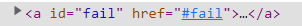

# Je sui une théière

> **Divers** - _Facile_

## Énoncé

Le travail que vous avez fourni jusqu'à maintenant est remarquable, surtout pour une nouvelle recrue ! Une pause café ne vous ferait pas de mal. Je ne vous propose pas de thé : j'ai égaré ma théière par erreur sur un site web... Si jamais vous la retrouvez, faites-moi chauffer de l'eau et je vous récompenserai, foi de CSS117 !

Format du flag : `404CTF{chaîne de caractères trouvée en leet}`

> Attention, https://ctf.404ctf.fr ne fait PAS partie de la zone de jeu sur laquelle vous pouvez utiliser des méthodes offensives.
>
> Le site https://css117.fr n'a rien à voir avec le 404 CTF

## Fichiers

_Aucun_

---

## Solution

Ce challenge est assez vague dans son énoncé... Pourtant tout est dans le titre : _Je suis une théière_...

### I'm a teapot

Pour les personnes qui ne connaîtraient pas ce statut erreur HTTP, taper sur Google "_Je suis une théière_" nous amène sur la page suivante : https://developer.mozilla.org/fr/docs/Web/HTTP/Status/418

Il s'agit initialement d'un code d'erreur mis en place comme poisson d'avril, mais la farce est restée.

L'expression `j'ai égaré ma théière par erreur sur un site web` mets bien en valeur l'idée qu'il faut provoquer une erreur sur un site web lié à la compétition.

### Retrouver la théière

En réalité, il s'agit plus d'une erreur 404 qu'il faut provoquer. Si vous avez été chanceux, vous avez à un moment mal écrit l'URL l'adresse du CTFd de la compétition.

En effet, n'importe quelle adresse du type **_ce-que-vous-voulez_.404ctf.fr** renvoie une page d'erreur 418.


Les premiers paragraphes sont informatifs (c'est bel et bien une véritable paga d'erreur !), mais la suite nous intéresse fortement :

`SI VOUS AVEZ DU TEMPS À PERDRE, VOUS POUVEZ AIDER CETTE THÉIÈRE À RETROUVER SON CHEMIN JUSQU'À LA PLAQUE CHAUFFANTE. NOTEZ QU'ELLE FAIT DU THÉ ET PAS DU CAFÉ. NOTEZ AUSSI QUE LE JEU NE FONCTIONNE QU'AVEC DU CSS.`

Voilà notre défi.

### Labyrinthe-Théière

On trouve alors ce labyrinthe en bas de la page, accompagné de la consigne suivante :

```
Placez votre souris sur la case départ en haut à gauche. Lorsque vous survolez une case, des ponts aparaissent autour d'elle de sorte à ce que vous puissiez vous déplacer dessus avec votre curseur d'autant de cases qu'indiqué sur la première. Attention, gardez bien votre curseur sur les cases et les ponts, cela serait dommage de devoir repartir du début !Trouvez un chemin pour rejoindre le centre et vous serez récompensés... Il ne vous restera plus qu'à décoder.

```


La challenge consiste donc à déplacer son curseur depuis la zone de départ jusqu'au centre du damier. On remarque que lorsque l'on survole une case de valeur `i`, alors des ponts apparaissent autour de notre case de sorte à ce que l'on puisse dépalcer notre curseur par dessus pour atteindre les cases `i`-adjascentes à la nôtre.


On remarque qu'il ne faut pas sortir des cases ni des ponts au risque de retrouver ce sympathique message :


C'est donc un jeu de logique qu'il s'agit de résoudre. Mais la question est la suivante : s'il est codé en CSS (et oui c'est possible !), c'est que le flag est nécessairement stocké en local.

Toutefois, ce n'est pas vraiment le cas. On remarque qu'à chaque nouvelle case où l'on fait avancer la théière, 2 lettres majuscules apparaissent au centre du labyrinthe.

On peut en déduire que la concaténation des paires de lettres des cases formant l'unique chemin menant au centre formera le flag.

### Résolution

Plusieurs pistes en fonction de si l'on est plus ou moins joueur. Voici la méthode de résolution la plus rapide selon moi.

On commence par supprimer la _div_ d'échec dans l'inspecteur du navigateur.



De cette façon, on peut se balader librement avec le curseur, partout dans le labyrinthe. Ensuite, on essaie de remonter le chemin à l'envers. On part du centre et on regarde les cases qui permettent de s'y rendre. On répète l'opération jusqu'à arriver à un cul-de-sac. Alors on teste un autre chemin.

Il n'y a que 3 fausses pistes (courtes) et le bon chemin est dessiné ci-dessous :


On obtient alors la chaîne de caractères suivante :

`NDE4X0FfbTR6ZV9pbmdfVGU0UDB0`

C'est de la base64 qui donne le flag à encadrer :

`404CTF{418_A_m4ze_ing_Te4P0t}`

---

## Source

Vous trouverez dans [ce dossier]() le code source du challenge pour le retenter vous-même. Amusez-vous à speedrunner la théière, et qui sait, peut-être que _speedrun.com_ acceptera de faire une catégorie particulière !
