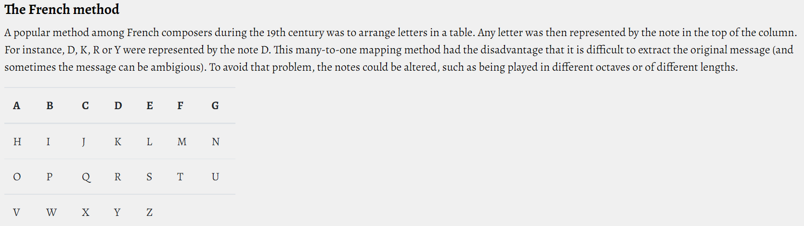

# La Méthode Française

> **Stéganographie** - _Difficile_

## Énoncé

Cela fait quelques mois maintenant que vous avez infiltré **Hallebarde**. Bien que votre réelle identité soit encore secrète, il est clair que certains de vos collègues doutent encore de vous. Il y a tout juste une semaine, vous demandiez justement d'être déplacé au pôle communications et transmissions radiophoniques, mais cela vous a été refusé. Votre hiérarchie a engagé à votre place un badeau venu de nulle part, apparemment violoncelliste à la Philarmonie de Paris, qui passe son temps à écouter de la musique classique à la radio et à griffonner sur un vieux bloc-notes. Lors de son arrivée, vous avez été chargé de lui remettre un bout de papier sur lequel était inscrit : `0 0 1 0 1 2 2 1 2 2 0 0 3 0 1 2 2 2 2 2 0 0 1 2 2 0`. Toutefois, vous n'avez pour le moment aucune idée de ce à quoi cette suite de chiffre peut bien servir...

Tiens, le voilà justement qui recommence à gribouiller ! Le présentateur radio annonce "La Méthode Française", interprêtée par Julien Simatra et dès les premières notes, le type se remet à écrire... La courte pièce se finit et soudain, le voilà qui court dans le bureau de votre supérieur en criant : _"Chef ! Chef ! C'est le signal !"_.

Mais de quel signal parle-t-il ?

Format du flag : `404CTF{signal}`

> Le signal est écrit en **majuscule**, **sans accent**, **sans espace entre les mots**. ( ex : 404CTF{UNTRESBONSIGNAL} )

## Fichiers

[LaMéthodeFrançaise.wav](./LaMethodeFrancaise.wav)

---

## Solution

Ce challenge n'est pas un défi de stéganographie audio habituel puisque rien n'est caché dans les données du fichier .wav en lui-même...

### Réviser ses gammes

Lire attentivement l'énoncé est essentiel ici, car il comporte quelques éléments utiles pour nous mettre sur la piste.

1. Le message a été décodé par un **violoncelliste** de la Philarmonie de Paris, qui parvient à comprendre le message en écoutant simplement la radio. Cette information confirme le fait qu'il n'y a pas à chercher du côté de l'encodage du fichier, des waveforms et globalement de tout ce qui nécessite un ordinateur moderne. Il suffit d'**écouter la musique**.

2. L'expression `dès les premières notes, le type se remet à écrire` sous-entend que ce sont les **notes** qui nous intéressent ici.

3. La pièce entendue à la radio s'intitule `La Méthode Française`, à l'instar du titre du challenge.

4. Nous récupérons un bout de papier sur lequel est inscrit `0 0 1 0 1 2 2 1 2 2 0 0 3 0 1 2 2 2 2 2 0 0 1 2 2 0`.

Clairement, il est question ici d'analyser les notes de musiques jouées par le pianiste.

### The French Method

Le titre de `La Méthode Française`, est trop particulier pour être anodin. En cherchant tel quel sur le web, nous ne trouvons rien de concluant. Toutefois, les mots clés : `Sheet Music Steganography`, ou `French Method Steganography` nous permettent d'en apprendre plus.

On trouve, entre autres, ce site web : https://www.boxentriq.com/code-breaking/music-steganography

En scrollant un peu on tombe sur ceci :



On y trouve un tableau qui associe aux 7 premières lettres de l'alphabet trois ou quatre autres lettres. Plus précisément, il s'agit d'une association de **lettres** aux **notes de musique** en NOTATION ANGLAISE.

Par exemple : un `DO` équivaut en anglais à un `C`. Via _The French Method_, il peut être décodé en `C`, `J`, `Q` ou `X`.

La question étant : comment trancher entre les trois voire quatre possibilités ?

### Transcription

C'est là qu'intervient le bout de papier retrouvé sur la table. En écoutant la musique, on distingue clairement la mélodie de l'accompagnement. Notamment, on peut compter **26 notes** qui se suivent. On remarque alors que le bout de papier comporte une suite de **26 chiffres** entre 0 et 3.

Nous pouvons donc en déduire que pour la `i`ème note que nous entendons, il suffit de se référer au `i`ème chiffre de la suite pour savoir à quelle ligne du tableau de _The French Method_ se référer.

Il est donc temps de transcrire l'audio en partition. Pour cela plusieurs façons :

- Vous avez l'oreille absolue, c'est pratique.
- Vous avez un ordinateur, c'est utile.
  - https://piano2notes.com/ est très performant. Pour outrepasser la limite de longueur de fichier, il suffit de le fractionner grâce à Audacity par exemple.
  - AnthemScore est un logiciel dont la verion d'essai suffit à transcrire la pièce.
  - https://scorecloud.com/ peut également servir.
- Vous n'avez pas fait de solfège mais vous avez du temps à perdre pour le faire à l'oreille quand même.
  - https://virtualpiano.net/

Il faut ensuite bien extraire les 26 notes de la mélodie et on obtient donc la série suivante :

`Ré - Mi - Mi - La - Fa - Sol - Mi - Si - Do - Sol - Mi - La - La - La - Sol - Fa - Fa - La - Sol - Fa - Mi - Do - La - La - Mi - Mi`

### Décodage

En superposant la notation anglaise et la suite de chiffre on obtient donc le tableau d'association suivant, que l'on décode via le tableau du site web :

```
D - E - E - A - F - G
0 - 0 - 1 - 0 - 1 - 2
D - E - L - A - M - U

E - B - C - G - E - A
2 - 1 - 2 - 2 - 0 - 0
S - I - Q - U - E - A

A - A - G - F - F - A
3 - 0 - 1 - 2 - 2 - 2
V - A - N - T - T - O

G - F - E - C - A - A
2 - 2 - 0 - 0 - 1 - 2
U - T - E - C - H - O

E - E
2 - 0
S - E
```

On obtient finalement le fameux vers de Paul Verlaine :
`404CTF{DELAMUSIQUEAVANTTOUTECHOSE}`

---

## Partition

Pour les pianistes qui veulent en faire leur version, voici la partition de _La Méthode Française_, telle qu'interprêtée par Julien Simatra :

[Télécharger la partition au format PDF](./La_M%C3%A9thode_Fran%C3%A7aise_Partition.pdf)

<div style="mix-blend-mode: difference;">


</div>
